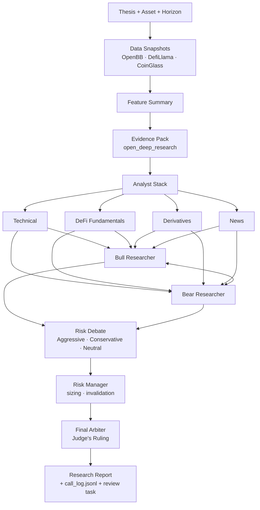

<div align="center">

# Crypto Multi-Debater

### Court-Style Debate-Driven Crypto Research Product

[](https://www.python.org/)
[](https://github.com/cwu339-pixel/crypto-multi-debater/actions/workflows/ci.yml)
[](https://openbb.co/)
[](https://defillama.com/)
[](https://github.com/)

</div>

---

<div align="center">

`Overview` | `Courtroom Structure` | `Showcase` | `Installation` | `Quickstart` | `Inspired By`

</div>

## Overview

Crypto Multi-Debater is a crypto-specific, court-style research product built around structured analyst evidence, adversarial debate, and final arbitration.

Instead of treating crypto as generic financial text generation, this repo uses:

- crypto-native data sources
- crypto-specific analyst roles
- sequential bull/bear and risk debates
- a final arbiter that turns debate into a courtroom-style ruling
- auditable artifacts and review tasks

This project is strongest as a **crypto multi-debater research product**, not as an auto-trading system or backtesting lab.

## Project Positioning

The cleanest way to describe this repo is:

- a `court-style multi-agent decision harness` for crypto research
- not a single-prompt chatbot
- not a naive score-only trading bot

The value is in the workflow discipline:

- analysts gather different classes of evidence
- bull and bear roles argue sequentially
- risk roles constrain position size and invalidation logic
- a final arbiter issues the ruling
- artifacts, call logs, and review tasks preserve the reasoning trail

If you are presenting this project, the right framing is:

> "I built an investment research court, not a slogan generator. The system separates evidence gathering, adversarial debate, risk control, and final judgment into auditable stages."

## Courtroom Structure

The system turns a market question into a structured research flow:

`thesis -> data snapshots -> feature summary -> evidence pack -> analyst stack -> bull/bear debate -> risk debate -> final arbiter -> research report`



### Bench Evidence

- `Technical Analyst`: reads crypto regime, volatility, RSI, SMA structure, and halving-cycle context
- `DeFi Fundamentals Analyst`: reads TVL, stablecoin yields, MC/TVL, and protocol-level capital signals
- `Derivatives Analyst`: reads funding, OI, liquidation stress, and leverage structure when available
- `News Analyst`: interprets crypto catalysts, regulation, unlocks, and macro spillover from the evidence layer

### Defense And Prosecution

- `Bull Researcher`: argues for continuation, asymmetry, and upside path
- `Bear Researcher`: argues for fragility, regime failure, and downside path

These roles are sequential, not parallel summaries. Each side responds to the other side's latest case.

### Sentencing And Guardrails

- `Aggressive`, `Conservative`, and `Neutral` risk views are synthesized inside the risk stage
- `Risk Manager` converts the debate into sizing, invalidation, and posture constraints

### Judge's Ruling

- reads the analyst stack, bull/bear debate, and risk debate
- produces the final trading-style report
- exposes decision, rationale, key factors, and hard rules

## How To Read The Scorecard

The report intentionally separates three ideas that are often conflated in weaker agent systems:

- `Action Score`: the baseline action inclination on a 0-100 scale. It is not a return forecast and not "probability BTC goes up."
- `Confidence`: how strongly the core market signals agree with each other. It is not just "how many APIs responded."
- `Data Quality`: an explicit record of missing core vs supplementary inputs. Supplementary gaps contribute at most a single `-5` penalty; they should not dominate the thesis.

That separation matters because these are different states:

- `high-confidence avoid`: the system is very sure the prudent action is defensive
- `low-confidence avoid`: the system cannot justify risk-taking because the picture is unclear
- `hold`: the quantitative baseline is cautious, but the final arbiter may still choose a less extreme posture after weighing the debate

This is closer to how a real investment committee behaves than a single blended score.

## Why Custom, Not CrewAI / AutoGen / LangGraph

Generic multi-agent frameworks (`CrewAI`, `AutoGen`, `LangGraph`) solve "how do agents coordinate" at a high level of abstraction. This repo solves a narrower, harder problem: **how does an adversarial research process produce an auditable crypto decision?** That required choices a generic framework wouldn't make for me:

- **Sequential, not parallel debate.** The bull must respond to the bear's latest case, and vice versa — parallel agent calls miss the core value of structured disagreement. CrewAI's default parallelism would flatten this into two unrelated summaries.
- **Crypto-specific role grammar.** `TVL`, `MC/TVL`, `funding`, `liquidation`, `unlock calendars`, `halving-cycle context` — the analyst prompts are written in crypto's native vocabulary, not generic "equity research" templates ported to a token.
- **Artifact-first, not chat-first.** Every stage writes durable JSON + Markdown to `runs/<run_id>/`. A reader can inspect each analyst's output, the full call log, and the final arbiter's reasoning independently — this is not an agent chat transcript.
- **Three-axis scorecard, not a single blended score.** `Action Score`, `Confidence`, and `Data Quality` are kept orthogonal on purpose (see "How To Read The Scorecard"). Most framework defaults collapse these into one vague "confidence" number.

Using a generic framework would have shipped faster. It also would have produced exactly the kind of "yet another CrewAI demo" that isn't useful to a real crypto research workflow.

## Why It Is More Crypto-Specific Than Generic Trading Agents

- It uses `OpenBB`, `DefiLlama`, and `open_deep_research` instead of generic equity-oriented analyst inputs.
- Its analyst roles are written for crypto market structure rather than stock research metaphors.
- It produces a crypto trading-style memo, not just a chat transcript or a generic LLM summary.
- It preserves research artifacts so the run can be inspected later.

## Current Live Capabilities

- `OpenBB` live market data fetch
- `DefiLlama` live protocol and yield data fetch
- `open_deep_research` live evidence collection with explicit fallback reasons
- prompt-driven first-order analyst outputs
- prompt-driven bull/bear debate
- prompt-driven risk layer and final arbiter
- rendered trading-style research report
- post-horizon review task generation

### Cost And Runtime

A single full run issues **~8 LLM calls** (4 analysts + bull + bear + risk + arbiter), totalling roughly **~2 minutes of LLM wall-time** on the showcase BTC case (see `showcase/runs/r_20260401T031358Z_BTC/agents/call_log.jsonl`). End-to-end cost is in the **~$0.10-0.50 per run** range depending on model tier (mini-class models land near the low end). The system is designed to be inspected run-by-run, not to be spammed at high frequency.

## Repo Boundaries

To keep the repository auditable, this repo separates maintained source code from reference and showcase output:

- `src/`, `tests/`, `config/`, and `docs/` are the maintained project sources
- `showcase/` contains committed example run artifacts used for homepage and demo-case inspection
- `external/open_deep_research/` is an upstream reference checkout, not the core local implementation

The main engineering changes should land in source directories. Showcase refreshes and upstream syncs should stay intentionally scoped so review diffs remain readable.

## Best Showcase Right Now

If you want one file that best represents the repo today, open this case:

- run: [`showcase/runs/r_20260401T031358Z_BTC/run.json`](showcase/runs/r_20260401T031358Z_BTC/run.json)
- report: [`showcase/research_cards/2026-04-01/BTC_r_20260401T031358Z_BTC.md`](showcase/research_cards/2026-04-01/BTC_r_20260401T031358Z_BTC.md)
- call log: [`showcase/runs/r_20260401T031358Z_BTC/agents/call_log.jsonl`](showcase/runs/r_20260401T031358Z_BTC/agents/call_log.jsonl)

That showcase includes:

- live OpenBB + DefiLlama ingestion
- live evidence collection
- crypto-specific analyst memos
- bull/bear debate
- risk debate
- prompt-driven final arbiter
- rendered report with visible court-style debate structure

## Demo Cases

- [Full Multi-Debater BTC Report](docs/demo_cases/01-full-multi-debater-btc-report.md)
- [Prompt-Driven BTC Analyst Stack](docs/demo_cases/02-prompt-driven-btc-report.md)
- [Review Loop Example](docs/demo_cases/03-review-loop-example.md)

## Installation

Clone the repo:

```bash
git clone https://github.com/cwu339-pixel/crypto-multi-debater.git
cd crypto-multi-debater
```

Create a virtual environment:

```bash
uv venv .venv
```

Install the package and dev dependencies:

```bash
uv pip install --python .venv/bin/python -e '.[dev]'
uv pip install --python .venv/bin/python openbb
.venv/bin/openbb-build
```

Copy the environment template:

```bash
cp .env.example .env
```

## Quickstart

Run tests:

```bash
PYTHONPATH=src .venv/bin/python -m pytest -q
```

Run the environment baseline check before live jobs:

```bash
.venv/bin/crypto-multi-debater preflight
```

Run a live research job:

```bash
.venv/bin/crypto-multi-debater run --asset BTC --horizon-days 3 --thesis "Assess BTC after recent rally"
```

Run pending reviews:

```bash
.venv/bin/crypto-multi-debater run-pending-reviews --output-dir .
```

## Data And Evidence Modes

- `OpenBB`: live price history
- `DefiLlama`: live protocol and yield data
- `CoinGlass`: optional derivatives adapter, graceful when unavailable
- `open_deep_research`: preferred evidence layer, with explicit fallback reasons when collection fails

## Current Limitations

- `CoinGlass` may be missing in live runs
- historical replay is strict for price, but not yet a full point-in-time replay for all sources
- evidence quality still depends on `open_deep_research` stability and source quality
- report tone is improving, but still less polished than a mature PM-authored memo
- this is not an auto-trading system

## Inspired By

- `TradingAgents`: debate-oriented analyst architecture
- `OpenBB`: market data access
- `DefiLlama`: DeFi and protocol datasets
- `open_deep_research`: evidence collection pattern

**My contribution is the court-style adaptation**: the sequential bull vs. bear debate, the three-axis scorecard (Action Score / Confidence / Data Quality), the risk-stage sentencing layer, and the auditable research card format are designed specifically for crypto decision-making — not inherited from `TradingAgents`. The data stack (`OpenBB` + `DefiLlama` + `open_deep_research`) replaces the equity-oriented inputs of upstream frameworks with sources that match how crypto research actually gets done.

## Changelog

- [2026-04] Homepage showcase refreshed to a live BTC debate report.
- [2026-03] `open_deep_research` live evidence path stabilized with readable fallback diagnostics.
- [2026-03] Full prompt-driven analyst, debate, risk, and final-arbiter stack landed in the live workflow.
- [2026-03] Refocused as a dedicated `crypto multi-debater research product` instead of a mixed benchmark / backtest repo.
